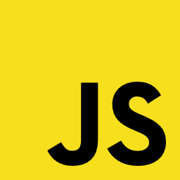
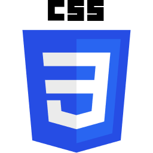
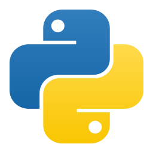

# **TRABAJO FINAL CODO A CODO**

# *PYTHON 2023* 

## **GRUPO** 1 

**CHIMENTI**, Viviana

**RICO**, Javiera

**ROUAN**, Patricio

**TALAVERA**, Luz

# Para poder abrir el Proyecto

## Instalaciones Necesarias:

Python
XAMPP
flask flask-sqlalchemy 
flask-marshmallow 
marshmallow-sqlalchemy 
pymysql  -U flask-cors 

Correr XAMPP 
Start Apache
Start mysql

## Creación de la Base de Datos:

**Nombre**: Proyecto 

**Estructura**:

iD - INT

nombre - VARCHAR

precio - FLOTADOR

stock - INT

pcategoria - VARCHAR

imagen - VARCHAR

Abrir el proyecto en VS Code. Ejecutar el archivo "app.py", en la consola o en la terminal de VS Code. Ingresar desde el navegador a la URL: http://127.0.0.1:5500/productos.html
 
Extension de VSC
https://marketplace.visualstudio.com/items?itemName=Postman.postman-for-vscode

---Despues de correr el proyecto---
Que ya tenemos la tabla Producto creada en la base

INSERT INTO `proyecto`.`producto` (`nombre`, `precio`, `stock`, `pcategoria`, `imagen`) VALUES ('Mouse', '12365', '10', 'https://http2.mlstatic.com/D_NQ_NP_744609-MLA32854739285_112019-O.webp'); 

## TECNOLOGÍAS

